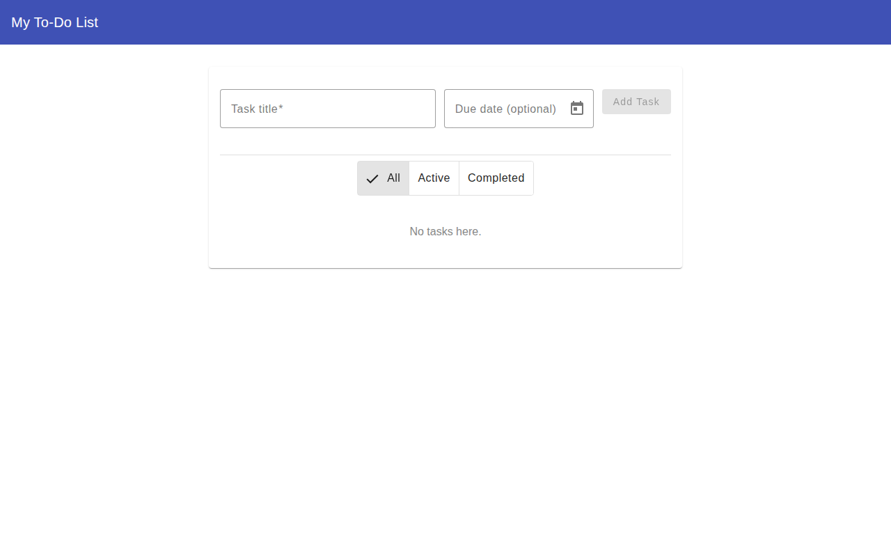
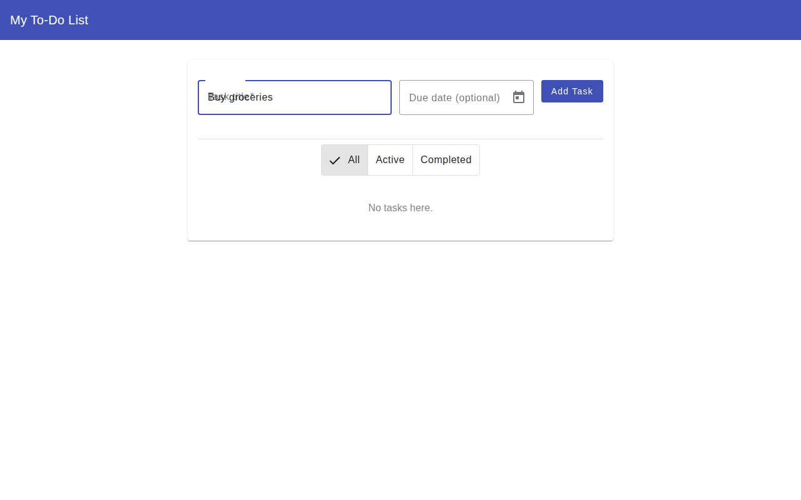
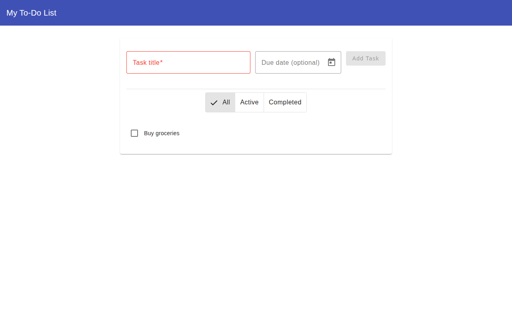
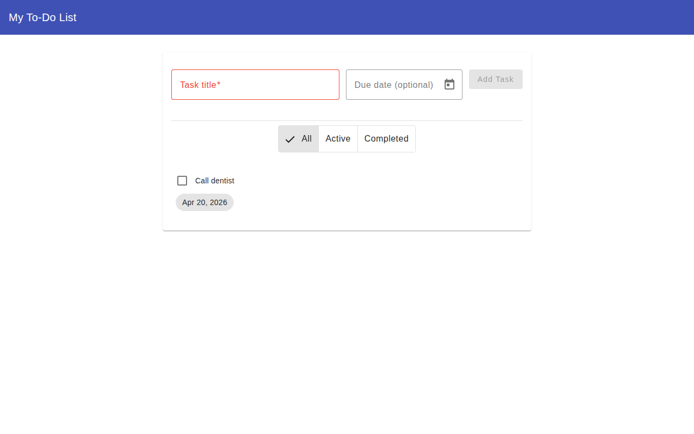
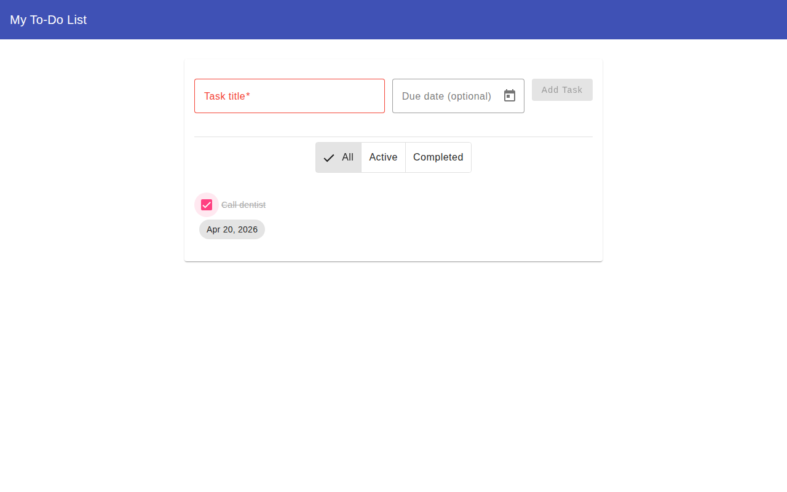
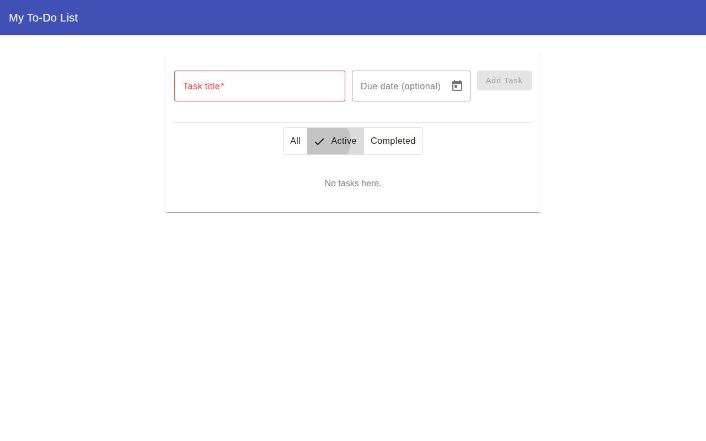
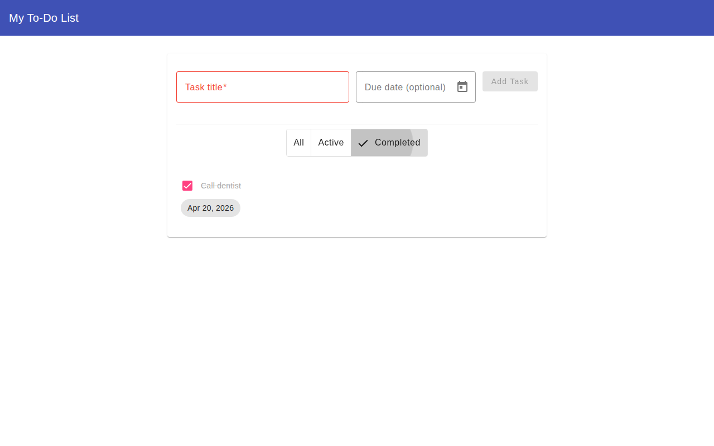

# Feature: To-Do App (MVP)

## Overview

A personal, single-user to-do application built with Angular 21 and Angular Material.
Tasks are persisted in the browser's `localStorage` — no backend required.

---

## Feature Scope

### 1. Add Tasks

Users can create new tasks by entering a title (required) and an optional due date.
The form validates that the title is not empty before the "Add Task" button becomes active.

**Screenshot: Empty state**


**Screenshot: Form filled**


**Screenshot: Task added**


---

### 2. Due Date Support

A date picker (Angular Material Datepicker) is available on the form.
When a due date is set, it is displayed as a chip below the task title.

**Screenshot: Task with due date**


---

### 3. Complete / Uncomplete Tasks

Each task has a checkbox. Clicking it toggles the task between active and completed.
Completed tasks are shown with a strikethrough label.

**Screenshot: Task marked as completed**


---

### 4. Filter Tasks

A toggle button group at the top of the list lets users filter tasks by status:

| Filter    | Shows                           |
| --------- | ------------------------------- |
| All       | Every task regardless of status |
| Active    | Only incomplete tasks           |
| Completed | Only completed tasks            |

**Screenshot: Active filter**


**Screenshot: Completed filter**


---

### 5. Persistence

All tasks are automatically saved to `localStorage` on every change.
Tasks survive page reloads and browser restarts (within the same browser/device).

---

## Out of Scope (MVP)

The following features were intentionally excluded from the MVP:

- Delete / edit tasks
- Task priorities or categories
- Multi-user / accounts / backend
- Drag & drop reordering
- Notifications or reminders for due dates
- Mobile-specific layout

---

## Architecture

| File                                  | Responsibility                                       |
| ------------------------------------- | ---------------------------------------------------- |
| `src/app/todo/task.model.ts`          | `Task` interface (id, title, dueDate?, completed)    |
| `src/app/todo/todo.service.ts`        | State management with Angular signals + localStorage |
| `src/app/todo/todo-form.component.ts` | Add task form (reactive form, Material UI)           |
| `src/app/todo/todo-list.component.ts` | Task list with filter toggle and checkboxes          |
| `src/app/app.ts`                      | Root shell: toolbar + card layout                    |

### State Management

`TodoService` uses Angular's `signal()` and `computed()` APIs:

- `_tasks` signal — source of truth, synced to `localStorage`
- `filter` signal — current filter selection (`'all' | 'active' | 'completed'`)
- `filteredTasks` computed — derived list based on `_tasks` + `filter`

---

## Running the App

```bash
npm start        # Dev server at http://localhost:4200
npm run build    # Production build
```
